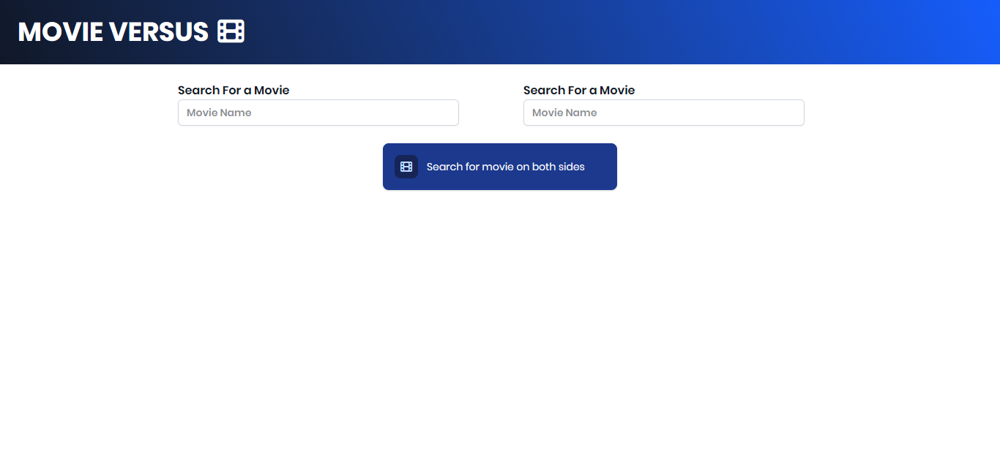
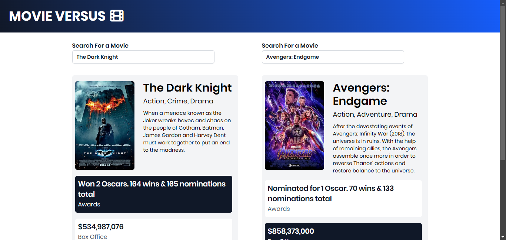

# Movie Comparision SPA

solely for learning purposes

## Technologies Used:

- Vanilla Javascript
- TailwindCSS

### Concepts learned:

this project incorporates several basic vanilla js concepts:

- DOM Manipulation
- Events Handling
- Mediocore Level of Server Side Rendering
- Async JS
    - fetchAPI
    - Async / Await

## Pages

main page

compare page (The Dark Knight vs Avengers: Endgame)

## Credits

- API: [omdbapi](http://www.omdbapi.com/)
